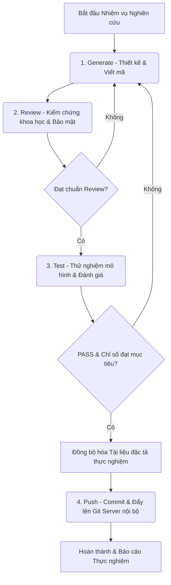

# Quy trình Tích hợp Generate - Review - Test - Push (Phiên bản Nghiên cứu Khoa học)

Tài liệu này hướng dẫn cách vận hành chu trình 4 bước **Generate - Review - Test - Push** để phát triển các mô hình thuật toán, phân tích dữ liệu và tích hợp code khoa học một cách chính xác, bảo mật.

## 1. Sơ đồ Quy trình Công việc

Chu trình làm việc được thực hiện theo dạng vòng lặp tuần tự:

## 2. Chi tiết Quy trình và Cổng kiểm soát (Gates)

### Bước 1: Generate (Xây dựng mô hình & Viết mã)
- **Hành động**: Phân tích tệp cấu hình thực nghiệm cụ thể (ví dụ: `docs/features/01-resnet-image-classification.md`) và triển khai viết code thuật toán/mô hình.
- **Quy tắc**:
  - Không hardcode tập dữ liệu thực tế, sử dụng tham số cấu hình hoặc biến môi trường.
  - Viết code bằng tiếng Anh, chú thích chi tiết công thức toán học bằng tiếng Việt.
- **Cổng ra (Exit Gate)**: Mã nguồn đã viết xong hoàn chỉnh, cấu trúc thuật toán rõ ràng, không sử dụng code giả hoặc placeholder `// TODO`.

### Bước 2: Review (Kiểm chứng khoa học & Rà soát)
- **Hành động**: Tự rà soát (Self-review) mã nguồn thuật toán.
- **Tiêu chuẩn**:
  - **Kiểm tra toán học**: Đảm bảo các phép toán ma trận, phép chia, tích phân... được bảo vệ tránh lỗi số học (như chia cho 0, tràn số, biến mất gradient).
  - **Bảo mật dữ liệu**: Đảm bảo tuyệt đối không có dữ liệu nội bộ chưa khử định danh, mật khẩu hoặc API key được ghi nhận trong mã nguồn.
  - **Ngôn ngữ**: Toàn bộ chú thích công thức và logic phức tạp phải viết bằng **Tiếng Việt**.
- **Lưu ý**: *Tuyệt đối không thực hiện cập nhật kết quả vào các file đặc tả khoa học ở bước này* vì mô hình chưa được huấn luyện và chạy thử thành công.
- **Cổng ra (Exit Gate)**: Mã nguồn sạch, an toàn, tối ưu toán học.

### Bước 3: Test (Thử nghiệm & Đánh giá)
- **Hành động**: Chạy các bài unit test logic toán và thực hiện chạy huấn luyện thử nghiệm trên dữ liệu giả lập (mock data).
- **Tiêu chuẩn**:
  - 100% các ca unit test thành công.
  - Các chỉ số hiệu năng (Metrics) thực tế (Accuracy, Loss, v.v.) đạt yêu cầu đề ra trong tệp đặc tả thực nghiệm.
- **Cổng ra (Exit Gate)**: Đạt tiêu chuẩn test và hoàn thành mục tiêu chỉ số hiệu năng.

### Bước trung gian: Đồng bộ hóa Tài liệu đặc tả (Doc-Code Sync)
- **Hành động**: *Chỉ thực hiện sau khi Bước 3 đã hoàn thành thành công.*
- **Nội dung**: Agent tự động cập nhật các siêu tham số tối ưu thu được và các chỉ số hiệu năng thực tế vào phần **Nhật ký Kết quả** trong tệp đặc tả của thực nghiệm cụ thể. Đồng thời đồng bộ các sơ đồ thuật toán, luồng dữ liệu mới vào các file tương ứng trong `docs/cores/`.

### Bước 4: Push (Lưu trữ nội bộ & Ghi nhận)
- **Hành động**: Cập nhật tệp báo cáo `walkthrough.md` với đầy đủ kết quả thực nghiệm chi tiết và tiến hành commit.
- **Quy tắc bảo mật nghiêm ngặt**: **Tuyệt đối cấm đẩy mã nguồn hay dữ liệu lên bất kỳ kho lưu trữ công cộng nào.** Chỉ đẩy lên Git Server nội bộ công ty.
- **Cổng ra (Exit Gate)**: Code và tài liệu đặc tả thực nghiệm được đẩy lên máy chủ nội bộ an toàn.

---

## 3. Quy tắc Kỷ luật Quy trình
1. **Bảo mật dữ liệu là trên hết**: Bất kỳ hành vi vi phạm chính sách bảo mật dữ liệu nội bộ ở bất kỳ bước nào đều không được chấp nhận.
2. **Kiểm chứng nghiêm ngặt**: Không bỏ qua kiểm chứng số học. Đảm bảo mô hình có thể tái lập kết quả.
3. **Đồng bộ đúng lúc**: Chỉ đồng bộ hóa nhật ký thực nghiệm vào tài liệu sau khi huấn luyện/đánh giá thành công (sau Bước 3).
