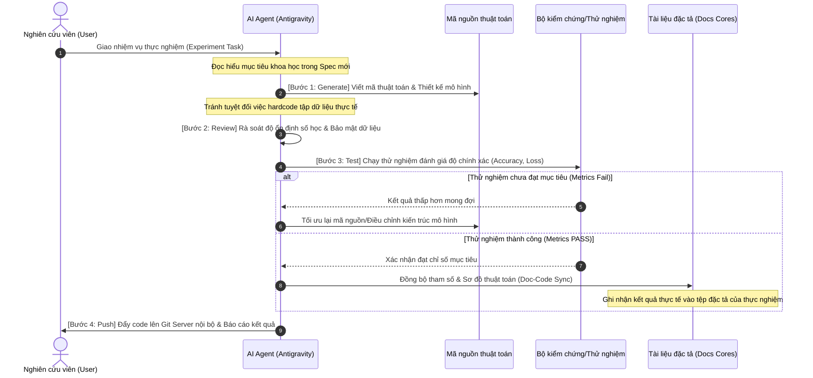

# Khung Làm Việc Cộng Tác AI-Native Cho Dự Án Khoa Học (AgenticAI - Scientific Version) 🚀🔬

**AgenticAI (Scientific Version)** là bộ khung boilerplate chuẩn hóa quy trình phát triển thuật toán, phân tích dữ liệu và nghiên cứu khoa học cộng tác giữa **Nghiên cứu viên/Lập trình viên (Researcher/Developer)** và **AI Agent** (như Antigravity, Claude, v.v.). Bộ khung này giải quyết bài toán quản lý tài liệu thực nghiệm, kiểm chứng tính đúng đắn toán học, bảo vệ dữ liệu nội bộ công ty và đảm bảo tính tái lập (reproducibility) của các thử nghiệm.

---

## 📁 Cấu Trúc Thư Mục và Vai Trò

```text
📦 hocp1 (Thư mục dự án khoa học của bạn)
 ┣ 📂 .antigravity            # "Bộ não" vận hành của AI Agent
 ┃ ┣ 📂 rules                 # Các quy định lập trình bắt buộc
 ┃ ┃ ┗ 📜 comment.md          # Quy tắc chú thích công thức toán học và logic bằng Tiếng Việt
 ┃ ┗ 📂 skills                # Các kỹ năng nâng cao của Agent
 ┃   ┣ 📂 lifecycles          # Chu trình nghiên cứu cốt lõi (Vòng đời phát triển)
 ┃   ┃ ┣ 📜 01-generate.md    # Bước 1: Xây dựng mô hình & Viết mã nguồn thuật toán
 ┃   ┃ ┣ 📜 02-review.md      # Bước 2: Tự rà soát thuật toán & Bảo mật tránh rò rỉ dữ liệu
 ┃   ┃ ┣ 📜 03-test.md        # Bước 3: Huấn luyện, đánh giá mô hình trên dữ liệu thử nghiệm
 ┃   ┃ ┗ 📜 04-push.md        # Bước 4: Lưu trữ Git nội bộ công ty & Ghi nhận kết quả
 ┃   ┗ 📜 workflow.md         # Tệp điều phối chính quy trình (Orchestrator)
 ┣ 📂 docs                    # Kho tri thức nghiên cứu khoa học của dự án (Source of Truth)
 ┃ ┣ 📂 cores                 # Các tài liệu đặc tả nền tảng hệ thống (Scientific Cores)
 ┃ ┃ ┣ 📜 01-data-pipeline.md # Quy trình tiền xử lý, cấu trúc dữ liệu và nguồn dữ liệu
 ┃ ┃ ┣ 📜 02-scientific-models.md # Đặc tả mô hình toán học, phương pháp mô phỏng, thuật toán
 ┃ ┃ ┣ 📜 03-visualizations.md # Thiết kế biểu đồ trực quan hóa dữ liệu và Dashboard kết quả
 ┃ ┃ ┣ 📜 04-confidentiality-security.md # Quy chế bảo mật dữ liệu, khử định danh & phân quyền nội bộ
 ┃ ┃ ┣ 📜 05-validation-testing.md # Chiến lược kiểm chứng độ chính xác toán học & unit test logic
 ┃ ┃ ┗ 📜 06-reproducibility-deployment.md # Quản lý môi trường (Docker/Conda) & chạy thực nghiệm
 ┃ ┣ 📂 features              # Đặc tả các thực nghiệm cụ thể (Experiment & Task Specs)
 ┃ ┃ ┗ 📜 00-experiment-spec-template.md # Mẫu lập đặc tả thực nghiệm mới (định nghĩa mục tiêu, siêu tham số, logs)
 ┃ ┗ 📂 walkthroughs          # Báo cáo kết quả nghiên cứu chi tiết qua từng giai đoạn
 ┣ 📜 ANTIGRAVITY.md          # Bản đồ định hướng chính cho AI Agent
 ┗ 📜 PROJECT_REQUIREMENTS.md # Đặc tả yêu cầu nghiên cứu khoa học & Thuật toán tổng quát
```

---

## 🔄 Quy Trình Phát Triển Khoa Học (Scientific Lifecycle)

Quy trình phát triển trong **AgenticAI** đảm bảo tính chính xác của thuật toán và độ an toàn của dữ liệu nội bộ.



### 🔄 Chi Tiết Chu Trình 4 Bước

1.  **Bước 1: Generate (Xây dựng mô hình & Viết mã)**
    *   **Nhiệm vụ**: Phân tích đặc tả từ tệp thực nghiệm cụ thể trong `docs/features/` và viết mã nguồn thuật toán (Python, R, v.v.).
    *   **Nguyên tắc**: Mã nguồn đặt tên biến/hàm bằng tiếng Anh chuẩn khoa học. Chú thích logic, công thức toán bằng tiếng Việt. Không viết mã giả, không hardcode đường dẫn dữ liệu cá nhân hay dữ liệu nhạy cảm.

2.  **Bước 2: Review (Kiểm chứng khoa học & Rà soát)**
    *   **Nhiệm vụ**: Rà soát độ ổn định số học (ví dụ: chia cho 0, tràn số - overflow, biến mất gradient), kiểm tra tính tối ưu của các vòng lặp xử lý ma trận.
    *   **Bảo mật dữ liệu**: Đảm bảo không chứa bất kỳ thông tin mật, API keys hoặc dữ liệu nội bộ chưa khử định danh trực tiếp trong code.

3.  **Bước 3: Test (Thử nghiệm & Đánh giá)**
    *   **Nhiệm vụ**: Thực thi các ca kiểm thử đơn vị đối với logic toán học và chạy thực nghiệm huấn luyện/đánh giá mô hình trên dữ liệu thử nghiệm (mock/test dataset).
    *   **Đồng bộ đặc tả**: Sau khi chạy thử thành công và đạt được các chỉ số mong đợi, Agent tự động điền các siêu tham số tối ưu và các chỉ số hiệu năng thực tế (Loss, Accuracy, F1...) vào tệp đặc tả của thực nghiệm đó.

4.  **Bước 4: Push (Lưu trữ nội bộ & Ghi nhận)**
    *   **Nhiệm vụ**: Tạo báo cáo kết quả thực nghiệm `walkthrough.md` và thực hiện commit.
    *   **Nguyên tắc**: **Tuyệt đối cấm đẩy mã nguồn hay dữ liệu lên các kho lưu trữ công cộng (GitHub public, GitLab public).** Chỉ được phép push lên Git Server nội bộ của công ty. Commit bằng Tiếng Anh phân tách rõ tiêu đề và mô tả.

---

## 🛠️ Hướng Dẫn Dành Cho Nghiên cứu viên / Lập trình viên

### Bước 1: Thiết Lập Yêu Cầu Nghiên Cứu
Xác định các mục tiêu khoa học tổng quát, nguồn dữ liệu và phạm vi nghiên cứu của công ty tại tệp [PROJECT_REQUIREMENTS.md](file:///d:/antigravity/hocp1/PROJECT_REQUIREMENTS.md).

### Bước 2: Thiết Lập Cấu Hình Thực Nghiệm Mới
1. Sao chép tệp mẫu [00-experiment-spec-template.md](file:///d:/antigravity/hocp1/docs/features/00-experiment-spec-template.md) thành một file đặc tả thực nghiệm mới trong thư mục `docs/features/` (ví dụ: `01-resnet-image-classification.md`).
2. Định nghĩa rõ: Giả thuyết khoa học cần chứng minh, tập dữ liệu đầu vào sử dụng và các chỉ số hiệu năng tối thiểu cần đạt được.

### Bước 3: Ra Lệnh Cho AI Agent Triển Khai
Ra lệnh cho AI Agent (như Antigravity): *"Hãy sử dụng cấu hình thực nghiệm tại `docs/features/01-resnet-image-classification.md` để triển khai mô hình"*. AI Agent sẽ tự động làm việc tuân thủ nghiêm ngặt theo chỉ dẫn trong [ANTIGRAVITY.md](file:///d:/antigravity/hocp1/ANTIGRAVITY.md).
