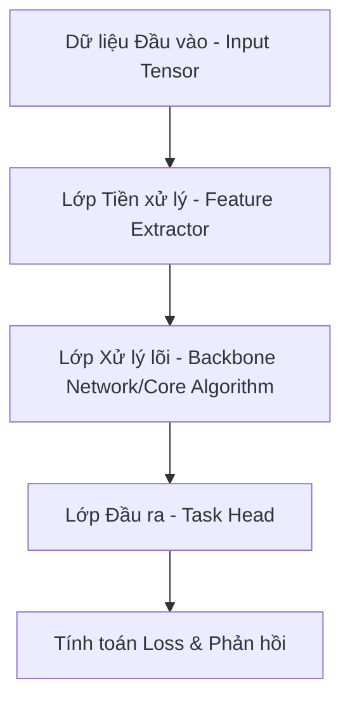

# Đặc tả Mô hình Khoa học & Thuật toán (Scientific Models & Algorithms Specification)

Tài liệu này đặc tả kiến trúc, công thức toán học cốt lõi và khung phát triển của các mô hình khoa học/máy học áp dụng trong dự án.

## 1. Kiến trúc Mô hình (Model Architecture)

Mô hình được thiết kế theo cấu trúc mô-đun hóa để đảm bảo khả năng tái sử dụng và kiểm thử độc lập:

## 2. Công thức Toán học & Thuật toán cốt lõi

### Hàm mất mát (Loss Function)
Mô hình sử dụng hàm mất mát kết hợp nhằm tối ưu cả độ chính xác trung bình và tránh overfitting thông qua chuẩn hóa L2:

$$L = \frac{1}{N} \sum_{i=1}^{N} (y_i - \hat{y}_i)^2 + \lambda \sum_{j=1}^{M} w_j^2$$

Trong đó:
- $y_i$: Giá trị nhãn thực tế.
- $\hat{y}_i$: Giá trị mô hình dự báo.
- $\lambda$: Hệ số phạt chính quy hóa (Regularization coefficient).
- $w_j$: Các trọng số của mô hình.

### Độ ổn định số học (Numerical Stability Rule)
Mọi phép chia ma trận hoặc tính logarit phải có hằng số bảo vệ $\epsilon = 10^{-8}$ nhằm ngăn chặn lỗi số học $NaN$ hoặc $Infinity$:

$$\text{Loss} = -\frac{1}{N} \sum (y \log(\hat{y} + \epsilon))$$

## 3. Khung Công nghệ & Thư viện (Frameworks & Libraries)
- **Framework chính**: **PyTorch** (phiên bản LTS ổn định) hoặc **Scikit-learn** tùy theo tính chất bài toán.
- **Tính toán ma trận**: Sử dụng **NumPy** và **SciPy** cho các phép toán đại số tuyến tính chuyên sâu.
- **Quản lý thiết bị**: Luôn viết code hỗ trợ cấu hình thiết bị động (CPU/CUDA) để tận dụng phần cứng GPU nội bộ của công ty.
