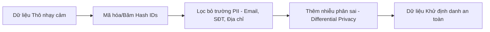

# Quy chế Bảo mật Dữ liệu & An toàn Nghiên cứu (Confidentiality & Security Specification)

Dữ liệu và kết quả nghiên cứu khoa học của công ty là tài sản trí tuệ tối mật. Tài liệu này quy định các nguyên tắc bảo mật bắt buộc phải áp dụng trong suốt vòng đời dự án.

## 1. Phân loại và Bảo vệ Dữ liệu (Data Classification)

- **Dữ liệu Mật (Confidential Data)**: Dữ liệu khách hàng thực tế, thông tin định danh cá nhân (PII), bí mật công nghệ, và dữ liệu thô chưa qua kiểm duyệt.
  - *Quy tắc*: Tuyệt đối không lưu trữ trong mã nguồn, không push lên Git Server (dù là nội bộ) nếu chưa được mã hóa hoặc phân quyền bảo vệ nghiêm ngặt.
- **Dữ liệu Kiểm thử (Test/Mock Data)**: Dữ liệu giả lập, dữ liệu công cộng được cấp phép, hoặc dữ liệu mật đã được khử định danh (anonymized).
  - *Quy tắc*: Cho phép sử dụng trong môi trường kiểm thử cục bộ.

## 2. Quy trình Khử Định danh Dữ liệu (Anonymization Protocol)

Trước khi đưa dữ liệu vào huấn luyện mô hình hoặc phân tích, dữ liệu mật phải đi qua bộ lọc khử định danh:

### Các kỹ thuật bắt buộc:
1. **Băm Hash định danh**: Chuyển đổi mã khách hàng, ID nhân viên thành chuỗi Hash không thể đảo ngược (SHA-256 kèm Salt).
2. **Loại bỏ PII**: Xóa bỏ hoàn toàn các cột chứa Tên, Email, Số điện thoại, Địa chỉ cụ thể.
3. **Differential Privacy (Bảo mật vi phân)**: Khi cần thiết, thêm một lượng nhiễu toán học nhỏ vào dữ liệu thống kê để đảm bảo không thể suy ngược ra thông tin của một cá nhân đơn lẻ.

## 3. Quản lý Quyền truy cập & Lưu trữ (Access Control)
- **Quản lý khóa bảo mật (Credentials)**: Sử dụng tệp `.env` (được đưa vào `.gitignore`) để cấu hình thông tin truy cập Database dữ liệu thô. Tuyệt đối không hardcode mật khẩu, token trong code.
- **Git Server nội bộ**: Mã nguồn chỉ được push lên Git Server được chỉ định của công ty, không cấu hình remote tới các nền tảng public bên ngoài.
